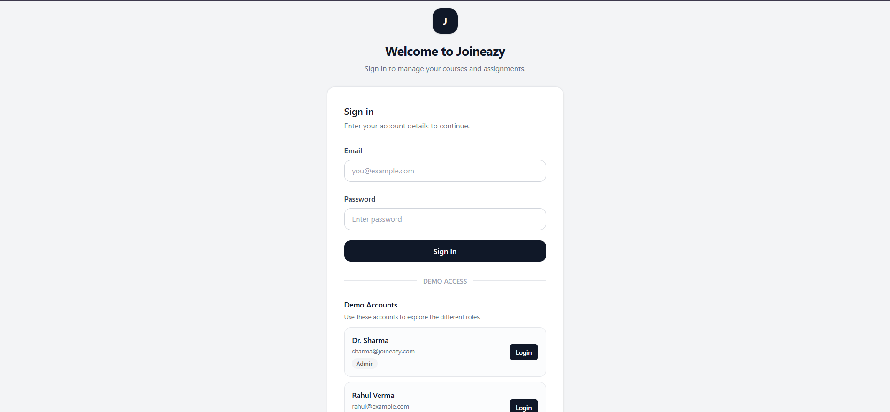
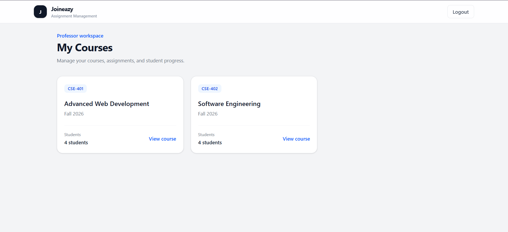
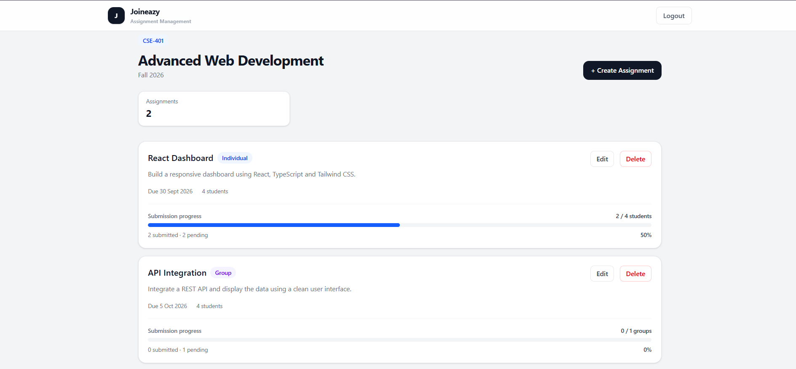
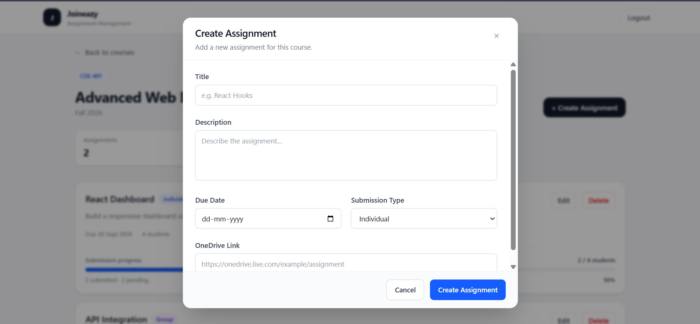
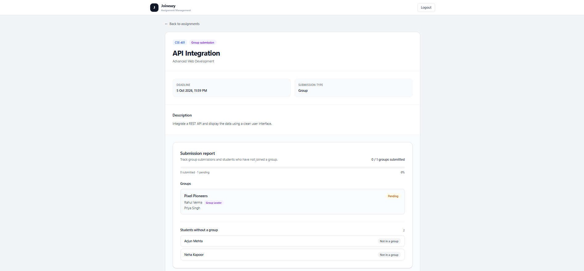
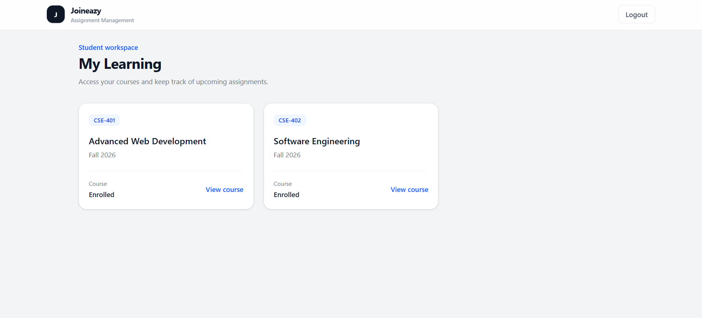
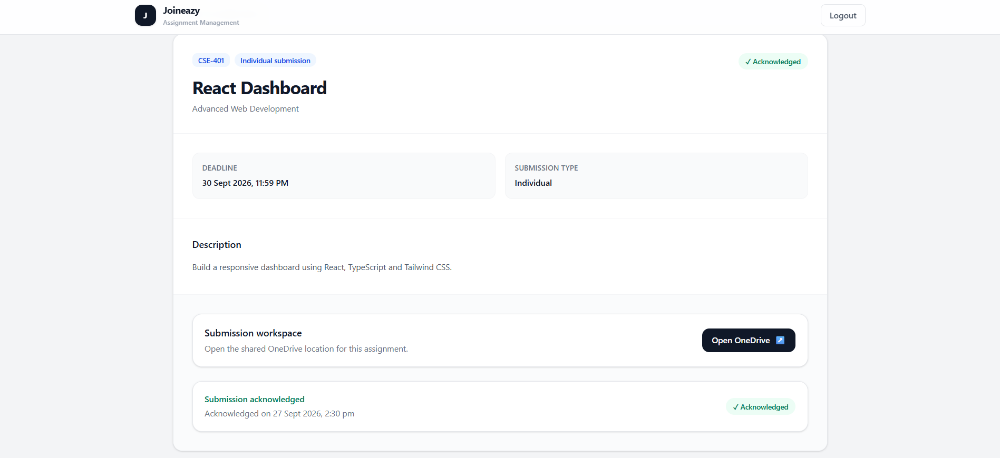
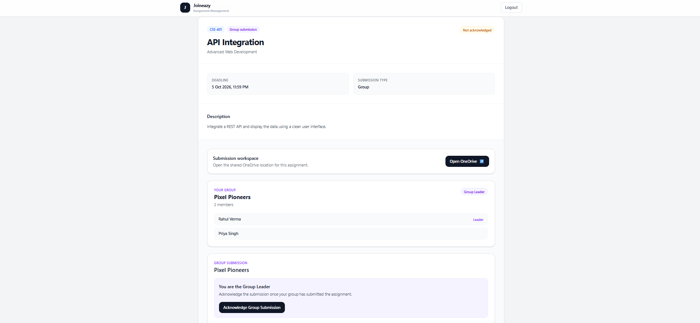
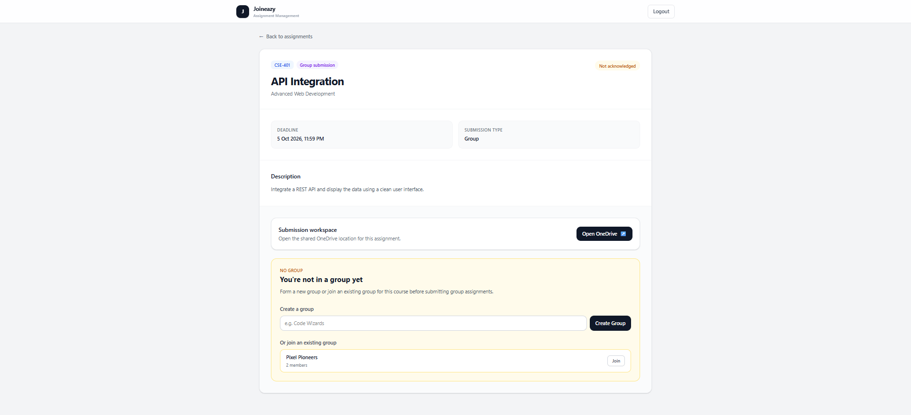

# Joineazy Assignment Management Dashboard

A responsive frontend application for managing courses, assignments, student submissions, and group-based assignment workflows.

This project was built as part of the **Joineazy Frontend Internship - Round 2** assignment, with a focus on frontend architecture, role-based user experiences, responsive UI, and smooth interaction flows.

## Live Demo

[View the deployed application](https://joineazy-dashboard-brown.vercel.app)

## Repository

[View the GitHub repository](https://github.com/Shaurya03/joineazy-dashboard)

---

## Overview

The application provides two role-based experiences.

### Professor

- View courses taught
- View assignments for each course
- Create, edit, and delete assignments
- Configure individual or group submissions
- Attach OneDrive links
- Track student/group submission progress
- View detailed submission reports

### Student

- View enrolled courses
- View assignments for each course
- View assignment details and deadlines
- Open the associated OneDrive workspace
- Acknowledge individual submissions
- Create or join groups for group assignments
- Only group leaders can acknowledge group submissions
- See acknowledgment status and timestamps

The application uses mock data and browser `localStorage` to simulate persistent application state.

---

## Features

### Authentication & Role-Based Access

- Demo login screen with predefined accounts
- Professor and student roles
- Role-based dashboard rendering
- Current user persisted using `localStorage`
- Logout functionality

> Authentication is simulated on the frontend because this implementation does not include a backend service.

### Professor Dashboard

Professors can:

- View all courses they teach
- Open a course to view its assignments
- Create assignments
- Edit existing assignments
- Delete assignments with confirmation
- Configure:
  - Assignment title
  - Description
  - Deadline
  - OneDrive link
  - Submission type
- View submission progress
- View detailed student/group submission reports

### Student Dashboard

Students can:

- View enrolled courses
- Open course assignment lists
- View assignment details
- See assignment deadlines
- Open OneDrive submission locations
- Acknowledge individual submissions
- Create groups
- Join existing groups
- View group members
- See whether they are a group leader

### Group Assignment Workflow

For group assignments:

1. A student can create a new group.
2. Other students can join an existing group.
3. Group membership is displayed on the assignment page.
4. Only the group leader can acknowledge the group's submission.
5. Once acknowledged, all members of the group are marked as submitted.
6. Professors can see group submission progress.
7. Students who are not part of a group receive a clear prompt to create or join one.

### Submission Tracking

Professors can view:

- Number of submitted students
- Number of pending students
- Submission percentage
- Individual student status
- Acknowledgment timestamps

For group assignments:

- Number of submitted groups
- Number of pending groups
- Submission percentage
- Group members
- Group leader
- Students who have not joined a group

### UI & UX

- Responsive layout
- Mobile-friendly components
- Role-specific navigation
- Hover and focus states
- Progress bars
- Status badges
- Toast notifications
- Confirmation dialogs
- Modal entrance and exit animations
- Escape-key support for modals
- Outside-click dismissal for delete confirmation
- Keyboard-accessible interactive cards and controls

---

## Tech Stack

- React
- TypeScript
- Vite
- Tailwind CSS
- React Hooks
- localStorage
- Vercel

No external UI component library was used. The interface was built using reusable React components and Tailwind CSS utilities.

---

## Architecture

The application follows a component-based architecture with application state separated from presentation.

```text
src/
├── components/
│   ├── AssignmentDetails.tsx
│   ├── AssignmentForm.tsx
│   ├── CourseAssignments.tsx
│   ├── CourseCard.tsx
│   ├── CourseDashboard.tsx
│   ├── GroupPanel.tsx
│   ├── Login.tsx
│   ├── Navbar.tsx
│   ├── ProfessorSubmissionReport.tsx
│   └── Toast.tsx
│
├── data/
│   └── mockData.ts
│
├── hooks/
│   └── useAppData.ts
│
├── types/
│   └── index.ts
│
├── App.tsx
├── index.css
└── main.tsx
```

### Component Responsibilities

#### `App.tsx`

Acts as the main application coordinator.

Responsible for:

- Current user state
- Navigation between dashboard, course, and assignment views
- Login/logout flow
- Toast notifications
- Connecting application state to UI components

#### `useAppData.ts`

Contains the main application data logic.

Responsible for:

- Assignments
- Submissions
- Groups
- Group members
- localStorage persistence
- Creating/updating/deleting assignments
- Creating and joining groups
- Individual acknowledgment
- Group acknowledgment

This keeps data manipulation out of the main UI components.

#### `CourseDashboard.tsx`

Displays courses available to the current user.

The content changes based on the user's role.

#### `CourseAssignments.tsx`

Displays assignments belonging to a selected course.

Professors can manage assignments and view progress, while students can view assignment acknowledgment status.

#### `AssignmentDetails.tsx`

Displays the complete assignment information and role-specific submission interface.

Students see their submission workflow, while professors see the submission report.

#### `GroupPanel.tsx`

Handles student group management for group assignments.

It supports:

- Creating groups
- Joining groups
- Displaying group members
- Showing group leader status

#### `ProfessorSubmissionReport.tsx`

Provides detailed submission analytics for professors.

The report adapts between individual and group assignments.

#### `AssignmentForm.tsx`

Reusable modal form for creating and editing assignments.

#### `Toast.tsx`

Provides lightweight feedback after actions such as:

- Creating an assignment
- Updating an assignment
- Deleting an assignment
- Acknowledging a submission
- Creating a group
- Joining a group

---

## Data Model

The application uses TypeScript types to represent the core domain entities.

```text
User
 ├── role
 └── enrolled / teaching relationships

Course
 ├── professor
 └── students

Assignment
 ├── course
 ├── submission type
 ├── deadline
 └── OneDrive link

Submission
 ├── assignment
 ├── student
 ├── status
 └── acknowledgment timestamp

Group
 ├── course
 └── leader

GroupMember
 ├── group
 └── student
```

The relationships between these entities are represented using IDs, similar to how the data could later be persisted in a backend database.

---

## State Management

For this frontend-focused implementation, application state is managed using React hooks.

`useAppData` centralizes the main application state and exposes the required operations to the rest of the application.

Persistent data is stored in browser `localStorage`.

The following data is persisted:

- Assignments
- Submissions
- Groups
- Group memberships
- Current logged-in user

This allows the demo to maintain changes after refreshing the page without requiring a backend.

---

## Authentication Approach

This version uses **simulated frontend authentication**.

The login screen provides predefined demo accounts representing the available roles.

The selected user ID is stored in `localStorage` and is used to determine the current role and available application flows.

No real credentials, password storage, JWT generation, or backend authentication service is implemented because this assignment focuses on the frontend experience.

A production implementation would replace this layer with:

```text
Frontend
    ↓
Authentication API
    ↓
Backend
    ↓
Database
```

and would use secure server-side authentication and authorization.

---

## Demo Accounts

The application includes predefined demo users so the different workflows can be tested easily.

### Professor

```text
Dr. Sharma
sharma@joineazy.com
Role: Admin / Professor
```

### Students

```text
Rahul Verma
rahul@example.com

Priya Singh
priya@example.com

Arjun Mehta
arjun@example.com

Neha Kapoor
neha@example.com
```

The demo login screen can be used to switch between the different roles.

---

## Screenshots

### Login



### Professor Dashboard



### Assignment Management



### Assignment Creation



### Professor Submission Report



### Student Dashboard



### Individual Assignment



### Group Assignment



### Group Creation / Joining



---

## Getting Started

### Prerequisites

Make sure you have installed:

- Node.js
- npm
- Git

### Installation

Clone the repository:

```bash
git clone https://github.com/Shaurya03/joineazy-dashboard.git
```

Navigate into the project:

```bash
cd joineazy-dashboard
```

Install dependencies:

```bash
npm install
```

Start the development server:

```bash
npm run dev
```

The application will be available at the local Vite development URL shown in the terminal.

---

## Production Build

To create a production build:

```bash
npm run build
```

---

## Deployment

The application is deployed using Vercel.

The GitHub repository is connected to the Vercel project, so updates pushed to the `main` branch trigger a new deployment.

Live application:

https://joineazy-dashboard-brown.vercel.app

---

## Design Decisions

### 1. Component-Based Architecture

The interface is split into focused components instead of keeping all UI logic inside `App.tsx`.

This makes individual workflows easier to understand, test, and modify.

### 2. Separation of Data and UI Logic

Application data operations were moved into `useAppData`.

This keeps components primarily responsible for rendering and user interaction.

### 3. Role-Based UI

Professor and student workflows share common components where possible while displaying different actions and information based on the current user's role.

### 4. localStorage for Persistence

Since this is a frontend-focused assignment, localStorage was used to simulate persistent application data without introducing unnecessary backend infrastructure.

### 5. Explicit Group Logic

Group submissions are modeled separately from individual submissions.

This allows the application to represent:

- Group membership
- Group leaders
- Group submission state
- Students without groups

instead of treating a group assignment as simply another individual submission.

### 6. Feedback and Interaction States

Actions provide immediate feedback through toast notifications, status badges, progress indicators, hover states, and modal animations.

The goal was to make state changes obvious without adding unnecessary complexity.

---

## Testing

The application was tested through the main professor and student workflows.

### Professor Flow

- Login as professor
- View courses
- Open a course
- Create an assignment
- Edit an assignment
- Delete an assignment
- View individual submission progress
- View group submission progress
- Open detailed submission reports

### Student Flow

- Login as student
- View enrolled courses
- Open assignments
- Open assignment details
- Open OneDrive link
- Acknowledge an individual submission
- Create a group
- Join an existing group
- View group membership
- Acknowledge a group submission as group leader
- Verify group acknowledgment state

### Build Verification

The production build was verified using:

```bash
npm run build
```

The deployed Vercel application was also tested after the final implementation.

---

## Future Improvements

For a production version, the application could be extended with:

- Backend API
- Real authentication and authorization
- JWT or session-based authentication
- Database persistence
- Real OneDrive integration
- File submission tracking
- Professor/student account management
- Course creation and enrollment management
- Search and filtering
- Email notifications
- Real-time submission updates

These were intentionally kept outside the scope of this frontend-focused implementation.

---

## Author

**Shaurya Chaudhary**

Built with React, TypeScript, Vite, and Tailwind CSS.